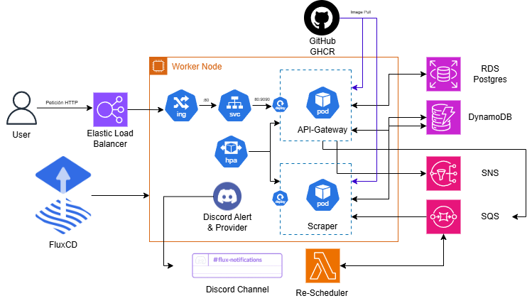

# FluxCD Repository


This repository contains the FluxCD configuration applied to my EKS and local clusters for my bachelor's thesis.

## Overview



The diagram above illustrates the microservices flow but also includes all the components deployed by FluxCD.

- Deployments and HorizontalPodAutoscaler (HPA) for both the Scraper and API microservices.
- Service for the API, which is the entry point, and an ingress rule that redirects all the traffic to the service port (`80`).
- An NGINX Ingress Controller, which deploys in AWS an Elastic Load Balancer.
- ImageUpdateAutomation to update automatically the image from the deployments if a new version is available.
- ConfigMap with the environment values for the microservices.
- Discord Alert and Provider to get notified from a Discord channel of all the reconciles of Flux. Requires to configure a secret in the `flux-system` namespace with the webhook url of the channel.

In addition, a metric server is deployed, without which the HPAs wouldn't work.

## Configuration & Requirements

Once the EKS cluster is deployed, we bootstrap the FluxCD repo within.

```bash
flux bootstrap github \
--owner=azuar4e \
--repository=flux-repo-tfg \
--branch=master \
--path=./clusters/home \
--token-auth \
--components-extra=image-reflector-controller,image-automation-controller
```

This installs the repository in the cluster. The token auth requests your GitHub Token, while the extra components installs those two additionally controllers that allow us to scan the GitHub registries that contains the images of the microservices and to update the yaml manifests.

Finally, we have to deploy the secrets for Discord, as mentioned previously, the AWS credentials, and a secret for the RDS access that is required by the API service.

```bash
{
kubectl create secret generic discord-url -n flux-system \ 
    --from-literal=address="<DISCORD_WEBHOOK_URL>"

kubectl create secret generic aws-creds \
  --from-literal=AWS_ACCESS_KEY_ID=<AWS_ACCESS_KEY_ID> \
  --from-literal=AWS_SECRET_ACCESS_KEY=<AWS_SECRET_ACCESS_KEY> \
  --from-literal=AWS_SESSION_TOKEN=<AWS_SESSION_TOKEN> \
  --from-literal=AWS_DEFAULT_REGION=us-east-1

kubectl create secret generic db-credentials \
    --from-literal=DB="host=db.dev.internal user=dbadmin password=<PASSWORD> dbname=mydb port=5432 sslmode=require"
}
```
